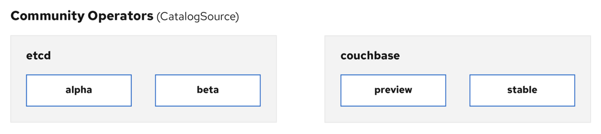
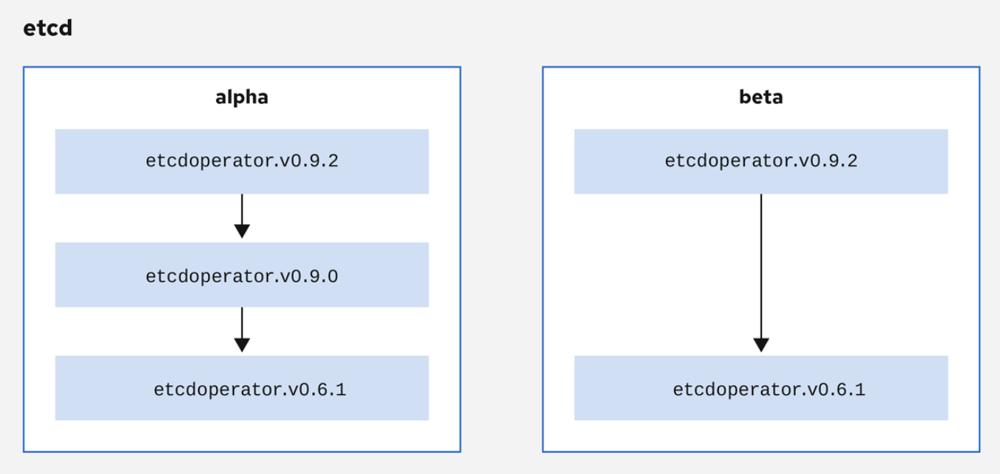

# Given an operator at version n, what should I do to create a version n+1?

## Introduction

In the Operator Lifecycle Manager (OLM) ecosystem, the following resources are used to resolve Operator installations and upgrades:

1. ClusterServiceVersion (CSV) - A ClusterServiceVersion (CSV) is a YAML manifest created from Operator metadata that assists the Operator Lifecycle Manager (OLM) in running the Operator in a cluster.

2. CatalogSource - Operator metadata, defined in CSVs, can be stored in a collection called a CatalogSource.

3. Subscription - A user indicates a particular package and channel in a particular CatalogSource in a Subscription.

OLM uses CatalogSources, which use the Operator Registry API, to query for available Operators as well as upgrades for installed Operators.

Within a CatalogSource, Operators are organized into packages and streams of updates called `channels`, which should be a familiar update pattern from OpenShift Container Platform or other software on a continuous release cycle like web browsers.

